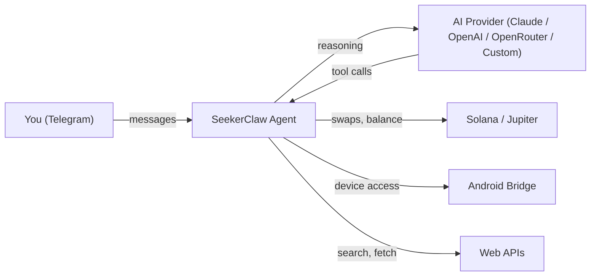

<div align="center">
  
  <br><br>
  <p>
    
  </p>
  <p>
    
    
    
    
    
    
    
    
    
    
    
  </p>
  <p>
    <a href="https://play.google.com/store/apps/details?id=com.seekerclaw.app"></a>
    &nbsp;
    <a href="https://github.com/sepivip/SeekerClaw/releases/latest"></a>
  </p>
  <p>
    <a href="https://www.producthunt.com/products/seekerclaw"></a>
  </p>
</div>

---

SeekerClaw embeds a Node.js AI agent inside an Android app, running 24/7 as a foreground service. You interact through Telegram or Discord — ask questions, control your phone, trade crypto, schedule tasks. **66 built-in tools (plus MCP remote tools), 35+ partner skills, Solana wallet, multi-provider AI (Claude + OpenAI + OpenRouter + any OpenAI-compatible gateway), extended thinking, graceful Stop**, all running locally on your device. Built for the Solana Seeker, runs on any Android 14+ phone.

<div align="center">
  
  
  
  
  
  
</div>

## 🏆 Award

**Winner — Solana Mobile Hackathon** · April 2026

SeekerClaw was selected as a winner of the Solana Mobile Hackathon, recognized for running a full AI agent on-device on the Solana Seeker.

[Announcement →](https://x.com/RadiantsDAO/status/2049549148395798847)

## Features

| | Feature | What it does |
|---|---|---|
| :robot: | **AI Engine** | Claude, OpenAI (API key + Codex OAuth), OpenRouter, or any OpenAI-compatible gateway (Custom). Multi-turn tool use, extended thinking on supported models |
| :thought_balloon: | **Extended Thinking** | Toggle in Settings → AI Provider → Reasoning or via `/think` from chat. Supported models (Opus 4.7, Sonnet 4.6, GPT-5.5, GPT-5.4, Codex) think across tool calls, with reasoning preserved across `/resume` and tool-loop turns |
| :speech_balloon: | **Channels** | Telegram (full bot — reactions, file sharing, inline keyboards) or Discord (Gateway v10 — DMs, media, reply threading) |
| :link: | **Solana Wallet** | Swaps, limit orders, DCA, transfers via Jupiter + MWA |
| :iphone: | **Device Control** | Battery, GPS, camera, SMS, calls, clipboard, TTS |
| :brain: | **Memory** | Persistent personality, daily notes, ranked keyword search, session summaries preserved across user-Stop |
| :alarm_clock: | **Scheduling** | Cron jobs with natural language ("remind me in 30 min") |
| :globe_with_meridians: | **Web Intel** | Search (Brave / Perplexity / Exa / Tavily / Firecrawl), fetch, caching |
| :gear: | **Live Settings** | Switch model or provider from Telegram with `/model` and `/provider`; no app reopen needed |
| :key: | **Env Vars** | Plug arbitrary API keys into the agent via Settings → Env Vars (single add or `.env`-style bulk paste). Skills and tools read them at runtime via `process.env.KEY`; values masked from debug logs. Skills can gate on `requires.env` so missing keys block activation cleanly |
| :bar_chart: | **Activity** | 26-week heatmap of your agent's API requests on the System screen — see when it's active, spot quiet days. Up to 13 months of daily history persisted on-device |
| :electric_plug: | **Extensible** | 35+ partner skills + custom skills + MCP remote tools |

<details>
<summary><strong>Architecture</strong></summary>

<br>



**On-device stack:**

```
Android App (Kotlin, Jetpack Compose)  ~27K lines, 68 files
 └─ Foreground Service (:node process)
     └─ Node.js Runtime (nodejs-mobile)  ~24K lines, 50+ JS modules
         ├─ ai.js                    — AI provider API, system prompt, conversations, /think
         ├─ message-handler.js       — Inbound message routing, commands, auto-resume
         ├─ providers/               — Claude, OpenAI (API key + Codex OAuth), OpenRouter, Custom adapters
         ├─ tools/                   — 60 tool handlers across 12 modules
         ├─ reasoning-gating.js      — Per-provider reasoning echo policy (R1 strip, V4 echo, etc.)
         ├─ reasoning-recovery.js    — Adaptive 3-step quarantine on 400 reasoning_content errors
         ├─ reasoning-redact.js      — sha256 fingerprint-only logging for reasoning content
         ├─ silent-reply.js          — [[SILENT_REPLY]] sentinel handling
         ├─ loop-detector.js         — Identical-call loop detection (3 warn / 5 break)
         ├─ http.js                  — HTTP/HTTPS transport, SSE streaming
         ├─ task-store.js            — Persistent task checkpoints
         ├─ solana.js                — Jupiter swaps, DCA, limit orders
         ├─ telegram.js              — Bot, formatting, commands, repetition detector
         ├─ telegram-commands.js     — Single-source registry for /commands menu + /help (drift-guarded)
         ├─ discord.js               — Discord Gateway v10 client + REST sends
         ├─ channel.js               — Channel router (telegram | discord)
         ├─ memory.js                — Persistent memory + ranked search
         ├─ skills.js                — Skill loading + semantic routing
         ├─ cron.js                  — Job scheduling + natural language parsing
         ├─ mcp-client.js            — MCP Streamable HTTP client (rug-pull detection)
         ├─ mcp-servers.js           — MCP server config CrossProcessStore (BAT-514)
         ├─ internal-control-server.js — Loopback control endpoints (/healthz, /mcp/reconcile, /shutdown/flush)
         ├─ runtime-state.js         — Live provider/authType/model overlay (BAT-513)
         ├─ agent-preferences.js     — searchProvider + agentName cross-process store (BAT-515)
         ├─ model-catalog.js         — Shared model registry (BAT-517)
         ├─ web.js                   — Search providers + fetch + caching
         ├─ database.js              — SQL.js analytics + flushForShutdown (BAT-525)
         ├─ security.js              — Prompt injection defense
         ├─ bridge.js                — Android Bridge HTTP client (main process)
         ├─ config.js                — Config loading + validation
         └─ main.js                  — Orchestrator + heartbeat + cron timer
```

</details>

## Quick Start

**Prerequisites:** Android Studio, JDK 17, Android SDK 35

```bash
git clone https://github.com/sepivip/SeekerClaw.git
cd SeekerClaw
./gradlew assembleDappStoreDebug
adb install app/build/outputs/apk/dappStore/debug/app-dappStore-debug.apk
```

Open the app → pick your AI provider (Claude, OpenAI, or OpenRouter) → enter your API key + [Telegram bot token](https://t.me/BotFather) + choose a model + name your agent — or generate a QR code at [seekerclaw.xyz/setup](https://seekerclaw.xyz/setup) and scan it. Done. For custom gateways (DeepSeek, Ollama, LiteLLM, etc.), configure in Settings after setup.

> **Step-by-step setup guide:** [How to set up SeekerClaw](https://x.com/SeekerClaw/status/2029197829068005849)

> **Beta** — SeekerClaw is under active development. Expect rough edges and breaking changes. Issues and PRs welcome.

## Partner Skills

Install via Telegram: send your agent the install link and it handles the rest.

| | Skill | What it does | Install |
|---|---|---|---|
| :ocean: | **Byreal** | Trade on Byreal DEX — pool analytics, swap quotes, LP positions, copy top farmers | [Install](https://seekerclaw.xyz/partner-skills/byreal.md) |
| :rocket: | **Career Companion** | AI career coach — job search, resume tailoring, mock interviews, salary research | [Install](https://seekerclaw.xyz/partner-skills/career-companion.md) |
| :paw_prints: | **ClawPump** | Launch tokens on Solana via pump.fun — gasless launches | [Install](https://seekerclaw.xyz/partner-skills/clawpump.md) |
| :crystal_ball: | **Dune Analytics** | Query onchain data — DEX trades, token stats, wallet activity | [Install](https://seekerclaw.xyz/partner-skills/dune-analytics.md) |
| :house: | **Home Assistant** | Control smart home — lights, climate, vacuum, alarm, media | [Install](https://seekerclaw.xyz/partner-skills/home-assistant.md) |

> **Build your own:** Skills are Markdown files with YAML frontmatter. See [SKILL-FORMAT.md](SKILL-FORMAT.md) for the spec.

## Important Safety Notice

SeekerClaw gives an AI agent real capabilities on your phone — including wallet transactions, messaging, and device control. Please be aware:

- **AI can make mistakes.** Large language models hallucinate, misinterpret instructions, and occasionally take unintended actions. Always verify before trusting critical outputs.
- **Prompt injection is a real risk.** Malicious content from websites, messages, or files could manipulate the agent. SeekerClaw includes defenses, but no system is bulletproof.
- **Wallet transactions are irreversible.** Swaps, transfers, and DCA orders on Solana cannot be undone. The agent requires confirmation for financial actions — read the details before approving.
- **Start with small amounts.** Don't connect a wallet with significant funds until you're comfortable with how the agent behaves.
- **You are responsible for your agent's actions.** SeekerClaw is a tool, not financial advice. The developers are not liable for any losses.

> **TL;DR:** Treat your agent like a capable but imperfect assistant. Verify important actions, secure your wallet, and don't trust it with more than you can afford to lose.

## Community

Thanks to all contributors:

<a href="https://github.com/sepivip"></a>
<a href="https://github.com/DashLabsDev"></a>
<a href="https://github.com/DyorAlex"></a>
<a href="https://github.com/LevanIlashvili"></a>
<a href="https://github.com/Tofu-killer"></a>

## Links

**Website:** [seekerclaw.xyz](https://seekerclaw.xyz) · **Product Hunt:** [SeekerClaw](https://www.producthunt.com/products/seekerclaw) · **Twitter:** [@SeekerClaw](https://x.com/SeekerClaw) · **Telegram:** [t.me/seekerclaw](https://t.me/seekerclaw)

---

<div align="center">

[Contributing](CONTRIBUTING.md) · [Security](SECURITY.md) · [Changelog](CHANGELOG.md) · [License](LICENSE)

</div>
